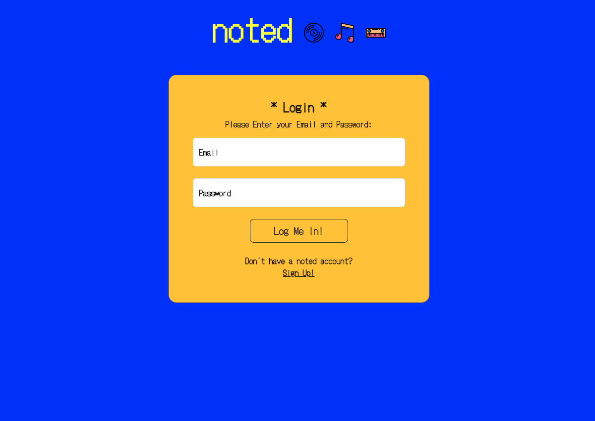
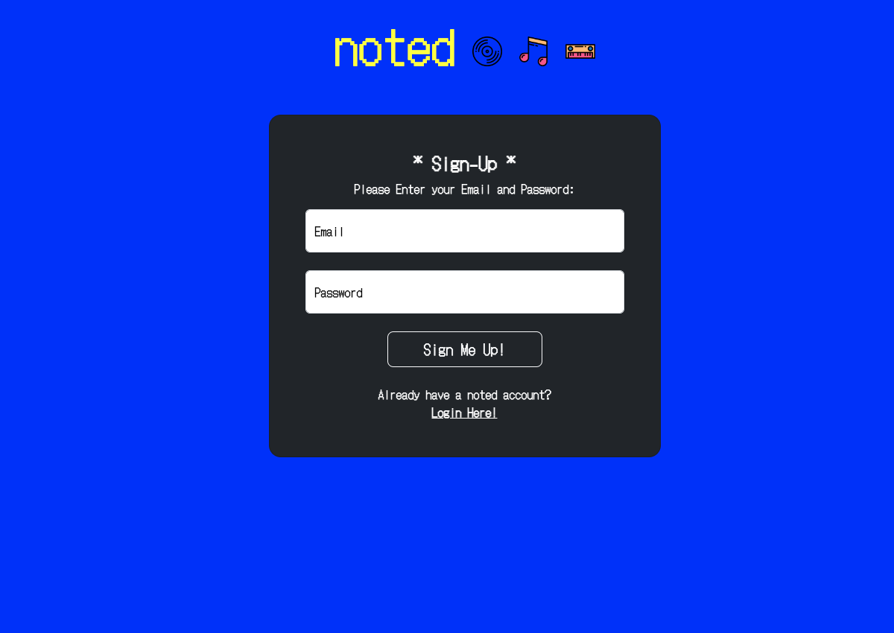
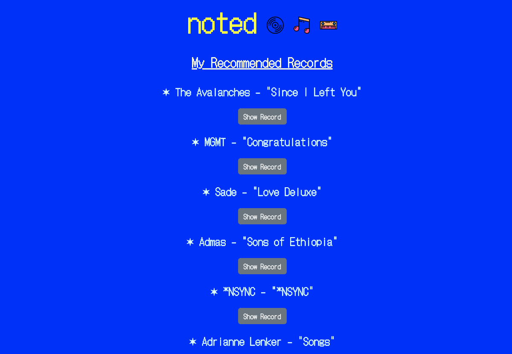
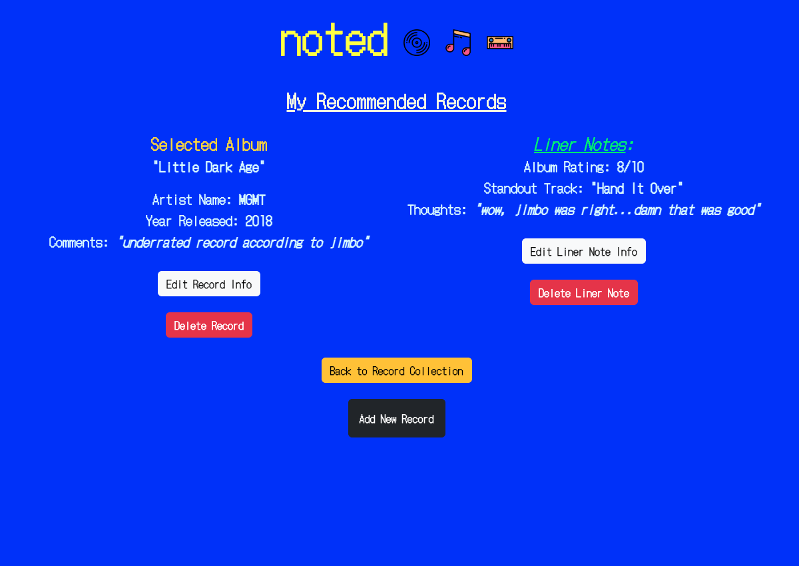
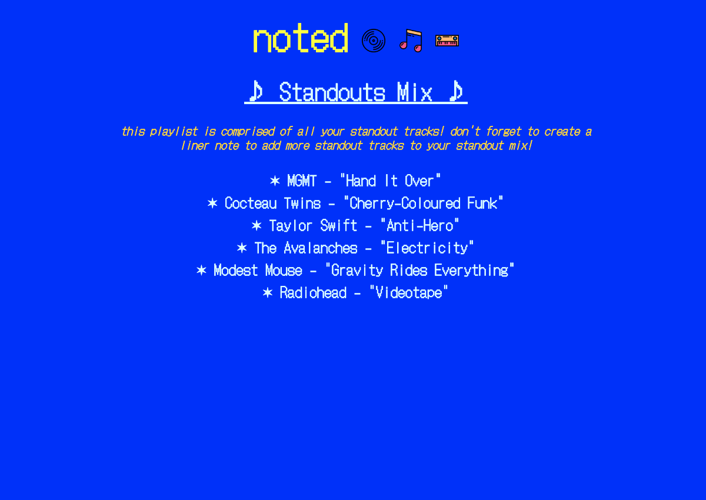
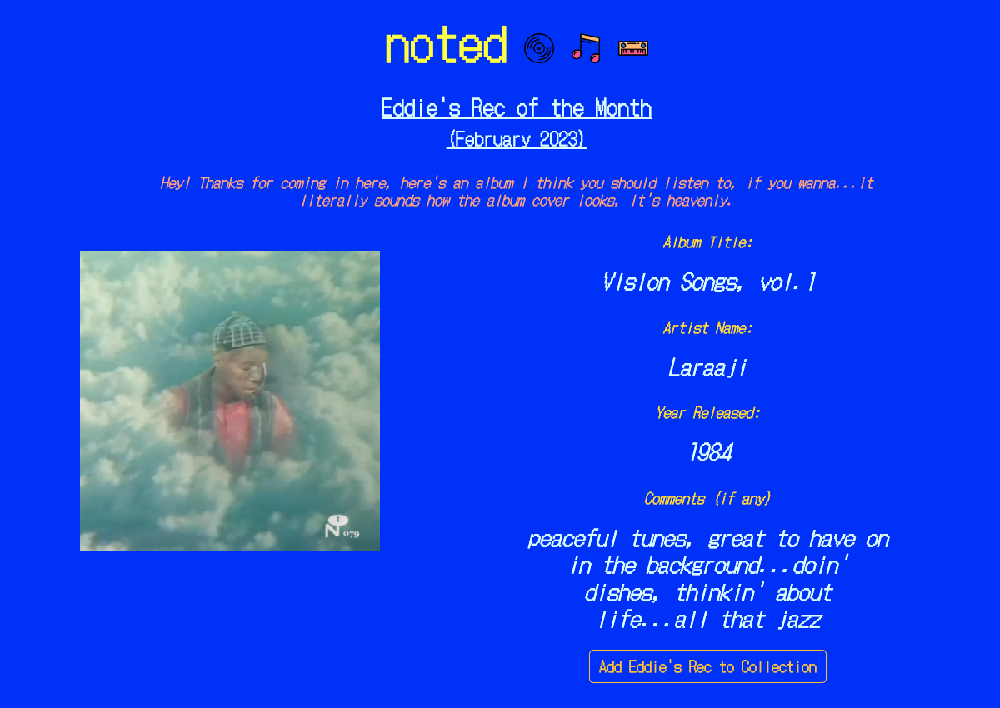
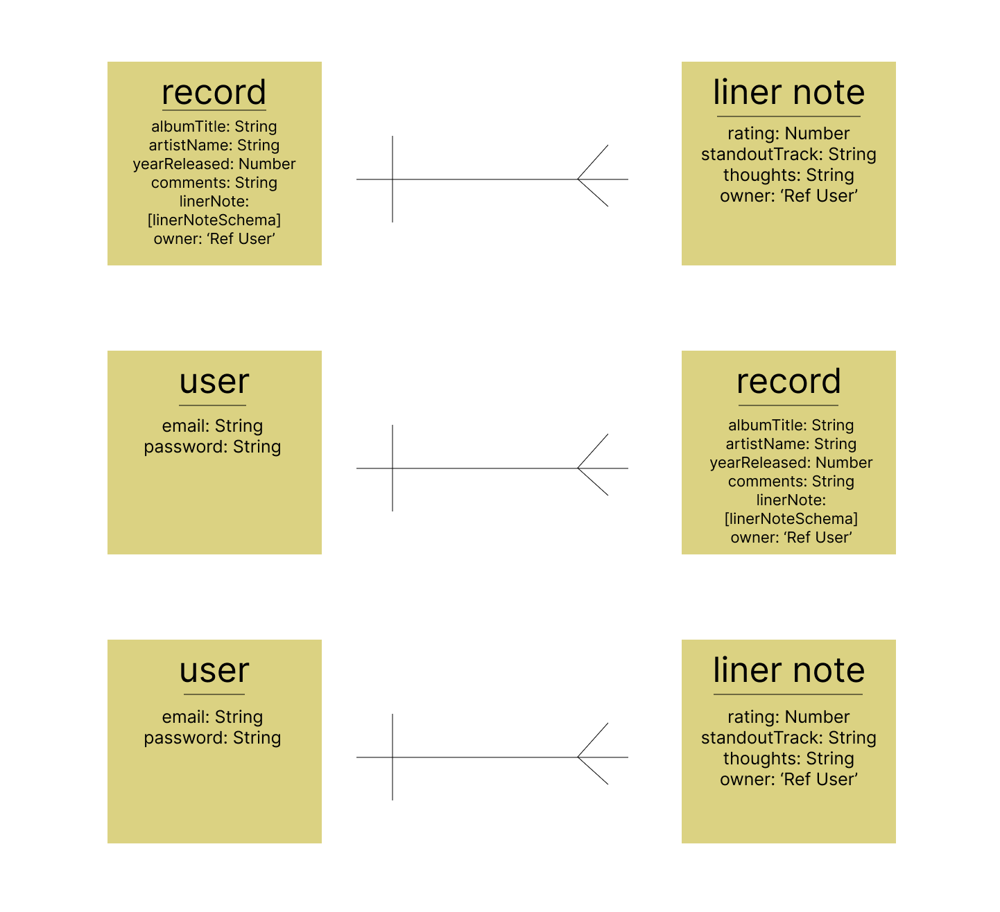

#

## <a href="https://noted.world/">Click to Demo</a>

## :pencil: Description

From the folks that brought you 'simon (ambient edition)' comes 'noted' – a minimal single-page application that allows users to build and track their own recommended record collection. Noted is designed to log any albums the user has intended to listen to. Once the user has given a listen through, they are encouraged to write a "liner note" – a review of the album comprised of a rating (1-10), a "standout track", and additional personal thoughts. Currently, additional features of the app include monthly record recommendations and a compiled playlist of the users' "standout tracks".

 

  
  ## :camera_flash: Screenshots
  
  

Login
</img>

  

Signup
</img>

  

My Recommended Records / Dashboard
</img>

  

Record View
</img>

  

Standouts Mix
</img>

  

Rec of the Month
</img>

## :computer: Technologies Used

## :cd: How To Use

🎵 What are you listening to? 🎶

1. `Create An Account` by using the Create An Account button at the bottom of the page.
2. Fill out the form and once completed click the `Sign Up` button to login.
3. Upon login, users will be navigated to the Dashboard / 'My Recommended Records' page, where they can view their current record collection.
4. `Click` the 'Add New Record' button at the very bottom of the page to add a new record.
5. Access a specific record's information & liner notes by `clicking` the 'Show Record' button underneath that album.
6. After listening to an album, add a 'liner note' to give the record a 1-10 rating, a 'standout track', and write any additional thoughts.
7. `Choose` any one of the icons in the navbar to navigate each page respectively.
8. The musical note icon leads users to the 'Standouts Mix' page, where they'll find all their Standout tracks from each album in one place.
9. `Click` the keyboard icon to see which album noted creator Eddie Hernandez is recommending this month on the 'Rec of the Month' page, and even add it to your own collection!

## :world_map: Design

    
Entity Relational Diagram (ERD)

  </img>

  
 Deployed Link (Heroku)

  <a href="https://noted.world/"
    > Noted Website</a>

## Routes Table

|   NAME    |           PATH          |   HTTP VERB   |                 PURPOSE                 |
| --------- | ----------------------- | ------------- | --------------------------------------- |
|  Index    |  /records               |   GET         | Displays all records in collection      |
|  Show     |  /records/:id           |   GET         | Shows a specific record (by record id)  |
|  Create   |  /records               |   POST        | Creates a new record                    |
|  Update   |  /records/:id           |   PATCH       | Updates a specific record (by record id)|
|  Delete   |  /records/:id           |   DELETE      | Deletes a specific record (by record id)|
|  Create   |  /liner-notes           |   POST        | Create a liner note attached to a specific record                         |
|  Update   |  /liner-notes/:id       |   PATCH       | Updates a liner note attached to a specific record (by sub-doc/record id)  |
|  Delete   |  /liner-notes/:id       |   DELETE      | Deletes a liner note (by sub-doc id)    |
|  Create   |  /sign-up               |   POST        | Creates a new user                      |
|  Create   |  /sign-in               |   POST        | Creates/bcrypts user token, grants user access to all SPA contents/containers |